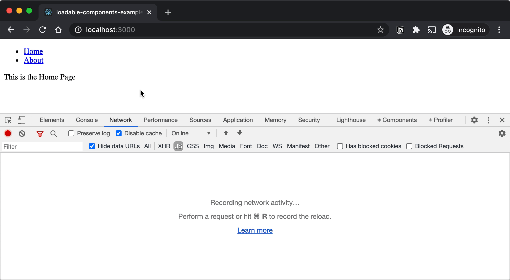

# Loadable Components SSR TypeScript Example


This example repository illustrates how to use [loadable-components][2] with an
SSR app and TypeScript.

## Features

- loadable-components with full support for Client- and Server-Side Rendering
- ReactJS Frontend
- NodeJS Backend
- TypeScript
- change webpack's `publicPath` during runtime
- with loadable routes (home and about), as well as loadable components (compare
  when and how the image is loaded in the client).

## Start

```bash
yarn
yarn build
yarn start

# or start the watch mode
yarn watch
```

Open <http://localhost:3000> and check out the network tab in your dev tools.

## Preview



## References

### Docs

- [loadable-components][2]
  - [Server Side Rendering](https://loadable-components.com/docs/server-side-rendering/)

### Examples

- [Server Side Rendering](https://github.com/gregberge/loadable-components/blob/8d29fef8f02e5b0cdd4a1add3399e48089a7b97a/examples/server-side-rendering)
- [Server Side Rendering with Apollo](https://github.com/gregberge/loadable-components/issues/282#issuecomment-491978634)

### Tutorials

- [Code splitting React components with TypeScript and NO Babel](https://blog.logrocket.com/code-splitting-react-components-with-typescript-and-no-babel/)
- [Typescript plugin for working better with styled-components react-loadable and loadable-components.](https://medium.com/@joking.young/three-typescript-plugins-for-working-better-with-styled-components-react-loadable-9ae00fba5656)

### Typescript Plugins

- [typescript-loadable-components-plugin](https://github.com/acrazing/typescript-loadable-components-plugin)
- [typescript-react-loadable-plugin](https://github.com/acrazing/typescript-react-loadable-plugin)
- or
  [https://github.com/Quramy/loadable-ts-transformer](loadable-ts-transformer)

### Issues

- [Typescript: nodeExtractor.requireEntrypoint returns undefined](https://github.com/gregberge/loadable-components/issues/620)

### Misc

- [How To Improve React App Performance with SSR and Rust](https://pagespeed.green/blog/how-to-improve-react-app-performance-with-ssr-and-rust-part-i-ssr)
  ([Example](https://github.com/pagespeed-green/react-ssr))
- [React Server Side Rendering with Koa Part II](https://blog.lovemily.me/react-server-side-rendering-with-koa-part-2/)
- [TSC Watch, Nodemon and Concurrently](https://sbcode.net/tssock/tsc-w-nodemon-conc/)
- Alternative: [react-loadable](https://github.com/jamiebuilds/react-loadable)

## Tasks and Ideas

- [ ] use `ForkTsCheckerWebpackPlugin` and use only `babel-loader`
      ([Example][1])
- [ ] Evaluate if we `watch` mode can be optimized

## License

MIT

[1]: https://github.com/hiroppy/ssr-sample/blob/master/webpack.config.js#L35
[2]: https://github.com/gregberge/loadable-components
